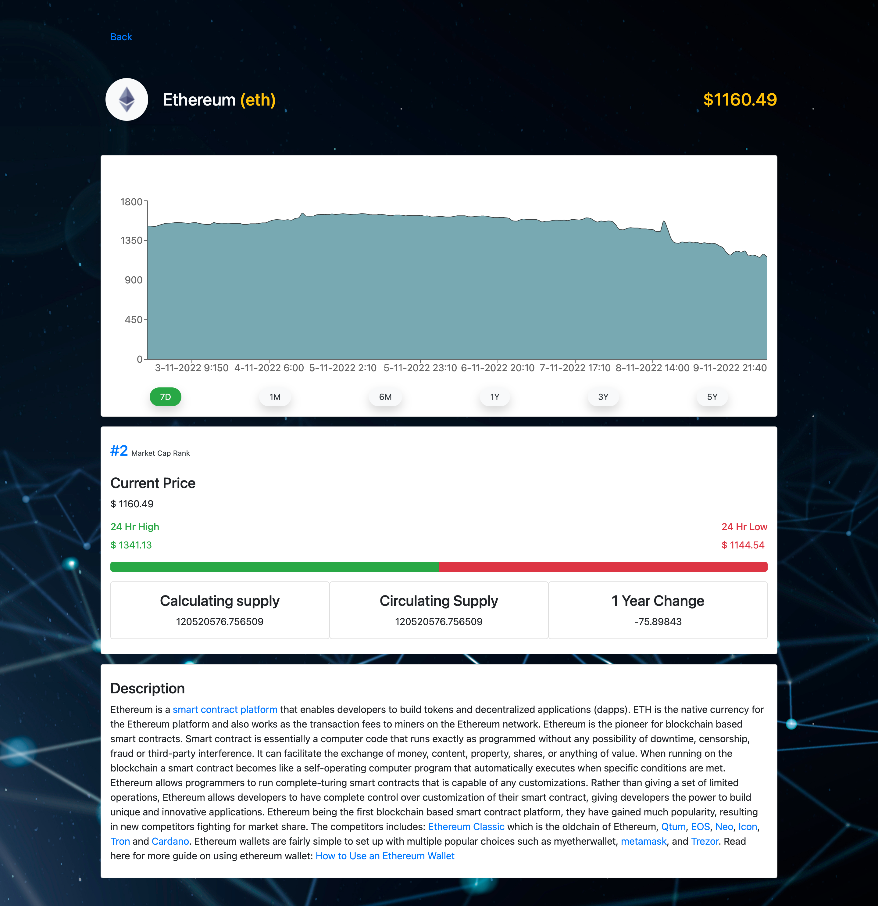

# React Crypto Tracker


## Getting Started

#### Run the following code on your terminal

```bash
  yarn install
  yarn start
```

## URL

```url
  GET http://localhost:3000
```

## Home Page


## Search Coin


## About Coin



